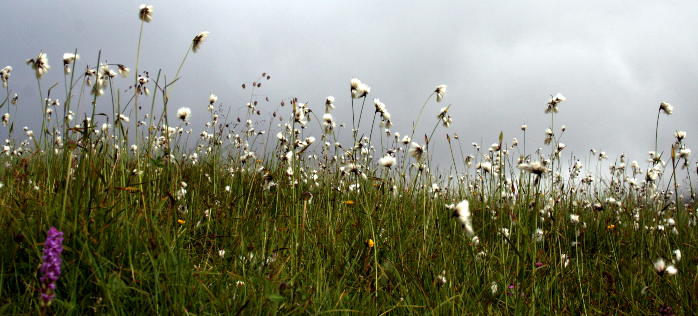

```{r setup, include=FALSE}
knitr::opts_chunk$set(echo = TRUE)
```

[](https://doi.org/10.5281/zenodo.4081418)



# Mire microclimate: Groundwater buffers temperature in waterlogged versus dry soils

This repository stores all the information related to the publication [Mire microclimate: Groundwater buffers temperature in waterlogged versus dry soils](https://doi.org/10.1002/joc.6893), including the raw datasets, the scripts to perform data cleaning and analysis, and the `Rmarkdown` files to create the manuscript.

## Contents

This repository is organised following the advice of [Wilson et al. 2017](https://doi.org/10.1371/journal.pcbi.1005510) for recording and storing research projects.


The following materials are available in the folders of this repository:

* `data` Original raw files including soil temperature recording.
* `doc` Files to create the manuscript using `Rmarkdown`.
* `results` Output of the `R` scripts, including clean data and figures.
* `src` Scripts in `R` language used to clean the raw data and perform the analyses of the [manuscript](https://github.com/efernandezpascual/mires/blob/master/doc/manuscript.md).

## Citation

Please cite any use of this repository as: 

> Fernández-Pascual E & Correia-Álvarez E (2021) [Mire microclimate: Groundwater buffers temperature in waterlogged versus dry soils.](https://doi.org/10.1002/joc.6893) *International Journal of Climatology*.