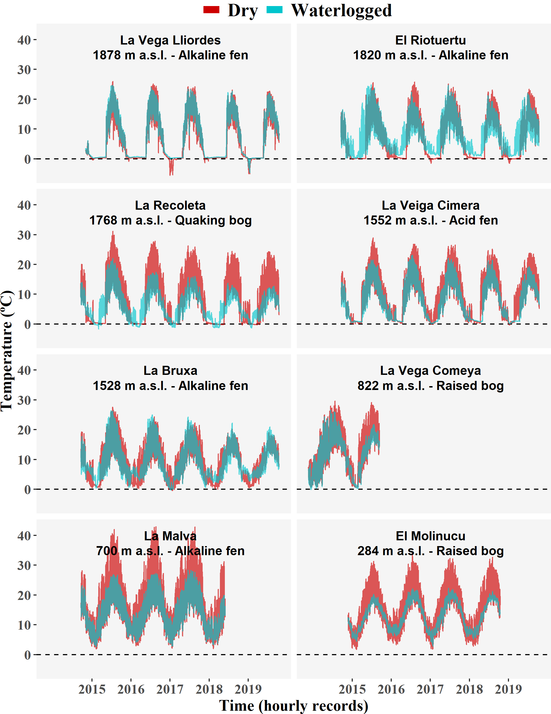
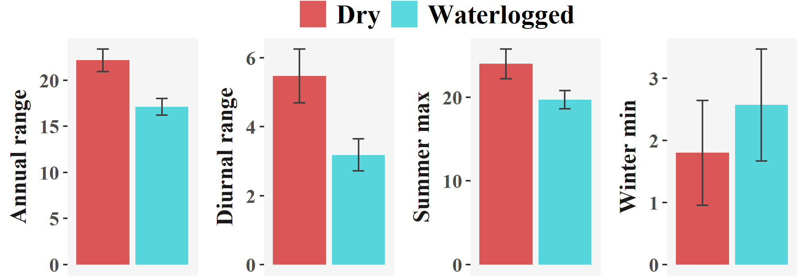

```{r setup, include=FALSE}
knitr::opts_chunk$set(echo = TRUE)
```

```{r message = FALSE, echo = FALSE, warning = FALSE}
library(tidyverse)
load("../results/logs.RData")
load("../results/MSoutput.RData")
```

Eduardo Fernández-Pascual^1^ ^+^, Eva Correia-Álvarez^1^

^1^ Universidad de Oviedo

^+^ Correspondence: Departamento de Biología de Organismos y Sistemas, Universidad de Oviedo, C/ Catedrático Rodrigo Uría, 33006 Oviedo/Uviéu, Spain. Email: efernandezpascual@gmail.com. Telephone: +34985104787.

# Abstract

Ecosystems adapt differently to global warming through microclimatic factors. Mires are sensitive wetland habitats that strongly rely on local soil properties, which makes them a good model to understand how local climatic parameters counteract the effects of climate change. We quantified the temperature buffering effect in waterlogged mire soils as compared with adjacent dry soils. 

We buried dataloggers at 5 cm depth in waterlogged and dry points in 8 mires of the Cantabrian Mountains (Spain, Southwestern Europe) and recorded soil temperatures for c. 5 years. We also compared our local measures with air temperatures predicted by the CHELSA model.

Waterlogged soils had less diurnal thermal amplitude (-2.3 ºC), less annual thermal amplitude (-5.1 ºC), cooler summer maximums (-4.3 ºC) and warmer winter minimums (+0.8 ºC). CHELSA air temperatures only correlated significantly (p < 0.05) with winter minimum soil temperatures (Pearson's r > 0.83), and CHELSA predictions were less accurate (higher RMSE) for waterlogged soils, except for the summer maximums.

We conclude that mire soils show a thermal buffer effect that insulates them from the surrounding landscape. This effect is stronger at the warm end of the climatic spectrum, i.e. during summer and at lower elevations. These results highlight the potential refugial character of mires under global warming, and the need to integrate microclimate measurements into climate change models.

**Keywords:** bog, CHELSA, climatic model, datalogger, fen, peatland, soil temperature, wetland 

# Introduction

Climate change [@RN3586] affects global biodiversity, from drylands [@RN4672] to forests [@RN4673] and oceans [@RN4674]. An accurate prediction of species responses requires to focus on physiologically relevant climatic variables related to critical plant growth periods [@RN4765]. Traditional models of species responses to global warming are based on macroclimatic data from weather stations. Recently, several authors have pointed out the need of complementing these models with *in situ* microclimatic measures [@RN4758; @RN4759; @RN4760; @RN4761]. As has been shown for European forests [@RN4763], ecosystems usually respond to broad climatic changes through local processes. Increasingly there are downscaling efforts based on atmospheric microclimate networks distributed in complex terrain that focus on topographic effects on air temperature [@RN3279], but hydrologic factors under edaphic control require more attention [@RN4942].

Mires are permanent semi-terrestrial peatlands whose soils remain waterlogged but not inundated during most of the year [@RN3161]. The term mire encompasses peatlands that are classified as either ombrotrophic (rain-fed bogs) or minerotrophic (groundwater-fed fens). These are azonal habitats whose existence depends on local soil properties rather than macroclimatic zonation [@RN3328]. Mires meet certain criteria that make them especially vulnerable to climate change [@RN4675]: (a) preponderance of species that evolved under a cold climate; (b) low productivity due to nutrient limitation, making them sensitive to increased nutrient cycling caused by warming [@RN4676]; and (c) scattered distribution pattern, which limits species dispersal and migration [@RN4677]. Therefore, mires are priority habitats for biodiversity conservation, harbouring high numbers of endangered species [@RN3122], and supporting highly adapted floras in spatially reduced areas [@RN2960]. Worryingly, mires retain high levels of methane and carbon which can be released due to global warming [@RN4764]. Habitat distribution models have predicted a loss of mire area as a consequence of ongoing climate change [@RN2937].

It has been known for a relatively long time that groundwater can produce a buffer effect on soil temperature, keeping soils warmer than air during cold periods, and vice versa [@RN4940; @RN3344; @RN3201]. Clara M. Frederick [-@RN4940] showed the existence of a buffer effect comparing soil temperatures taken at Cedar Bog (Ohio, United States) with temperatures from a neighbouring agricultural station. Recently, more soil temperature measurements have become available for mires of North America [@RN3204], Western Europe [@RN2356] and Central Europe [@RN4675]. Their comparison with air temperatures derived from models has shown that mire soils are indeed warmer in winter and cooler in summer, thus giving support to the existence of the groundwater thermal buffer [@RN2356; @RN4675]. Furthermore, the effect has been linked to the composition of mire flora and fauna [@RN4675; @RN4679], the growth rings of mire trees [@RN3060] and the role of mires as glacial refugia [@RN2513; @RN4680]. 

Since root-zone temperature is a major determinant of plant ecophysiology [@RN3024], the groundwater buffer effect is expected to allow mire plants to live in a wider range of air temperatures than they could otherwise. Indeed, mires have a relatively homogeneous flora across their range, despite their broad distribution. In Europe, fens are distributed from the Iberian Peninsula to boreal Fennoscandia and from low valleys to the alpine belt [@RN4678]. In the arctic, temperate-continental and suboceanic regions of boreal Russia mires make up an important part of the landscape, from 20 to 80 % of the surface of different regions stretching from Europe to the Pacific [@RN4937]. In the United States, fens are distributed across the glaciated Midwest and Northeast, as well as portions of the Appalachian Mountains and mountainous West [@RN4933]. However, continued aridification is expected to significantly reduce the overall extent of wetlands as it has been shown in the Midwestern United States [@RN4934]. 

It is evident that the groundwater buffer effect will play a determinant role in the response of mire habitats to climate change [@RN4936]. Both bogs and fens are actively peat forming and depend on precipitation, but fens rely also on sources of telluric water from mineral ground. Moreover, they show a mosaic of microreliefs and a specific plant cover zonation which makes them especially sensitive to small changes in wetness. Climate change affects the quantity, timing and spatial distribution of precipitation, leading to changes in surface wetness which alter the intensity or organic decomposition by disturbing the conditions for plant grow and the depth of air penetration [@RN4935]. Global warming would also result in warmer groundwater delivered to fens, but there is a gap of knowledge about the rate of such changes and their ecological consequences within the mires [@RN4936].

As is the case for all azonal habitats, locally measured temperatures are essential to understand these processes. Available references recorded temperatures only on waterlogged soils, using model-derived air temperatures for comparison [@RN2356; @RN4675; @RN4679]; or recorded temperatures in both wet and dry spots but for less than a year, lacking representation throughout the growth cycle of mire vegetation [@RN3204; @RN3060]. This article provides the first measurement of the thermal buffer against surrounding non-mire areas, based on soil temperatures recorded during a period of five years. These measures can be used to support previous evidence about the general effects of soil moisture on thermal buffering [@RN3204; @RN2356; @RN4675; @RN4936] and to determine the magnitude of this buffering within microrefugia habitats.  Specifically, we tested the hypotheses that, when compared to adjacent dry soils, waterlogged mire soils are (i) warmer in winter and (ii) colder in summer; and have less thermal amplitude in (iii) daily and (iv) annual scales. In addition, we compared *in situ* measurements with data derived from the CHELSA climatic models [@RN4766]. 

# Materials and methods

This study took place in the temperate oceanic region of north-western Spain (43º N, 5º W) (**Fig. 1a**). Local geography and climate are dominated by the Cantabrian Mountains (> 1500 m above sea level), which run parallel to the coast and trap the prevailing NW Atlantic winds. In the study area, average annual precipitation ranges from 800 mm at the low elevations to 1800 mm at the high mountains, while average annual temperature ranges from 12.5 ºC to 5 ºC (source = Agencia Estatal de Meteorología, http://www.aemet.es/es/serviciosclimaticos/). Under the most extreme emissions scenario, the latest projections expect temperatures to increase by 4 ºC and precipitation to decrease by c. 10 % by the end of the century, although the precipitation projections are subjected to great uncertainty [@RN4939]. The present humid and mild climate of this region harbours the south-western limit of mire communities in Europe [@RN2982; @RN3246]. Rain-fed raised bogs (https://eunis.eea.europa.eu/habitats/260) are very rare and appear locally on raised hummocks of acid valley mires (https://eunis.eea.europa.eu/habitats/526) which can be found from the coast to just below the treeline, in poorly drained valleys and former glacial lakes. Glacial lakes undergoing silting develop transition mires and quaking bogs communities (https://eunis.eea.europa.eu/habitats/1637) in the water-to-land transition. Spring fens appear in the mountains above 1000 m; they range from soft-water poor fens (https://eunis.eea.europa.eu/habitats/279) on acid bedrocks, to alkaline calcareous fens (https://eunis.eea.europa.eu/habitats/277) on limestone.

```{r fig1, echo = FALSE, message = FALSE, warning = FALSE, fig.pos = "H", fig.cap = "**Figure 1** **(a)** *Location of the study sites in northern Spain.* **(b)** *Representation of the sampling design at El Riotuertu site. The position of the dry and waterlogged temperature loggers is indicated, the blue area represents the extent of the waterlogged mire habitat.*", fig.width=7, fig.height=3.5}
knitr::include_graphics("../results/Fig1.png")
```

We selected `r length(unique(temperatures$Logger))/2` mire sites representing the regional elevation gradient of mire vegetation and the different mire types (**Table 1**). Although we classify two of these sites as rain-fed bogs based on their vegetation (*Oxycocco-Sphagnetea* Br.-Bl. et Tx. ex Westhoff et al. 1946), we must note that these bogs are very poorly developed on hummocks over valley mires and are in tight connection to the underlying water table coming from streams. Therefore, soil waterlogging in all our sites is fed by streams or springs. In each site, we buried two dataloggers (M-Log5W, GeoPrecision, Ettlingen, Germany; accuracy: +/- 0.1 ºC (at 0 ºC), resolution: 0.01 ºC) at a depth of 5 cm below the upper layer of the soil. In this ecosystem, it is at this depth that true soil begins to develop, under the porous upper layers made up of live mosses. We installed one datalogger in a flat waterlogged spot within the mire; the other one in the close vicinity, but in a flat and dry upland area outside the mire (**Fig. 1b**). The vegetation at the sampling points was always either mire or pasture, with no shrubs, trees or any other landscape features shading the measuring points. Dataloggers recorded temperature once every hour and stayed on site for approximately five years, after which we retrieved them and downloaded their records. At the moment of retrieval, the internal clock of all dataloggers had not deviated for more than four hours

```{r table1, echo = FALSE}
table1 %>% kableExtra::kable(caption = "**Table 1** *Mire sites included in this study, indicating the type of fen, pH, conductivity, elevation, coordinates, and length of the temperature recording period. Groundwater pH and conductivity values are the average of 5–10 measures per site taken with a MM40 Portable Multimeter (Crison Instruments S.A., Alella, Spain). Coordinates are in decimal degrees WGS84.*", format = "pandoc")
```

All data processing and analysis was performed in R [@RN2315]. To clean the logs we took the following steps: (i) removing records from the first week after installation, to account for the installation process and the settling of the soils; and (ii) keeping only time series with records for both the dry and waterlogged points, because some of the dataloggers had failed at different points in time. Afterwards, we calculated four bioclimatic variables for each datalogger: (1) the mean diurnal range; i.e. the average for the whole period of the daily differences between the maximum and the minimum temperatures recorded in the day; (2) the maximum temperature of the warmest month; i.e. the average of the daily maximum records, for the warmest month; (3) the minimum temperature of the coldest month; i.e. the average of the daily minimum records, for the coldest month; and (4) the annual range; i.e. the difference between the maximum temperature of the warmest month and the minimum temperature of the coldest month. These are classical bioclimatic variables that indicate the limiting factors (extreme temperatures) and seasonality (diurnal and annual range) that organisms must tolerate [@RN4943]. To compare our measurements with model-based predictions of air temperature, we downloaded from CHELSA the same bioclimatic variables for our measuring coordinates (https://chelsa-climate.org/bioclim/).

To test if the differences between dry and waterlogged points were significant, we used paired t-tests (n = 8 paired sites per each of the four bioclimatic variables). Tests were one-tailed, according to the original hypotheses: the dry point would have a higher diurnal range, a higher maximum temperature, a lower minimum temperature, and a higher annual range. To compare our soil measurements with the CHELSA air temperatures we calculated Pearson's correlation between both sets of values, and we also calculated the root-mean-square error (RMSE) of the CHELSA values as a measure of their accuracy (n = 8 sites per combination of bioclimatic variable and dry/waterlogged condition). We calculated RMSE using its implementation in the package *Metrics* [@RN4941]. We checked whether our data complied with the normality assumption of the t-test and Pearson's correlation using the Shapiro-Wilk normality test; the assumption was met in all cases (p > 0.05). To check whether the analyses were influenced by the fact that recording periods did not match across all eight sites, we repeated the analyses using only full-year, contemporaneous data series (01 Jan 2015 - 31 Dec 2017, excluding La Vega Comeya); the results of these analyses were the same as the ones presented in this article ([Supplementary **Tables S1** and **S2**](https://github.com/efernandezpascual/mires/blob/master/doc/supplementary.md)).

# Results

Dataloggers recorded temperatures for five years in five of the sites, four years in two, and two years in one. Time series showed considerably less variation at waterlogged points, for all eight site comparisons (**Fig. 2**).

```{r fig2, echo = FALSE, message = FALSE, warning = FALSE, fig.pos = "H", fig.cap = "**Figure 2** *Hourly soil temperature records at the mire sites. The blue series was recorded within the mire, in a waterlogged area. The red series was recorded in a neighbouring dry area. Dataloggers were buried at 5 cm depth. The amplitude of diurnal temperature range in dry sites was reduced with increasing elevation, where the thermal buffer effect was also less apparent.*", fig.width=7, fig.height=10}

```

Bioclimatic variables (**Table 2** and **Fig. 3**) supported this notion. The mean annual range was wider at dry points, as was the mean diurnal range. Maximum temperatures of the warmest months were usually higher at dry measuring points. The opposite was true for the minimums of the coldest months, in which case temperature was generally colder at dry points, although the difference was less pronounced than for the maximums (**Fig. 3**).

```{r fig3, echo = FALSE, message = FALSE, warning = FALSE, fig.pos = "H", fig.cap = "**Figure 3** *Average bioclimatic variables in the dry and waterlogged points. The bars represent the mean value, and the brackets the standard error of 8 records.*", fig.width=7, fig.height=3}

```

Patterns regarding the maximum temperatures and annual range were especially noticeable at both low (El Molinucu, La Malva) and high (La Recoleta) elevations. The pattern for the diurnal range, however, was more prominent just at the low sites (El Molinucu, La Malva), whereas the minimums of the coldest months showed no specific pattern (**Table 2**).

T-tests supported the original hypotheses; namely waterlogged measuring points had (a) smaller diurnal fluctuations (t = `r ttests %>% filter(Trait == "Diurnal range") %>% pull(t.statistic) %>% round(2)`, p = `r ttests %>% filter(Trait == "Diurnal range") %>% pull(t.p.value) %>% round(3)`, effect size = `r ttests %>% filter(Trait == "Diurnal range") %>% pull(t.estimate) %>% round(2)` ºC, 95 % CI = -∞, `r ttests %>% filter(Trait == "Diurnal range") %>% pull(t.conf.int.2.) %>% round(2)`); (b) lower maximums (t = `r ttests %>% filter(Trait == "Summer max") %>% pull(t.statistic) %>% round(2)`, p = `r ttests %>% filter(Trait == "Summer max") %>% pull(t.p.value) %>% round(3)`, effect size = `r ttests %>% filter(Trait == "Summer max") %>% pull(t.estimate) %>% round(2)` ºC, 95 % CI = -∞, `r ttests %>% filter(Trait == "Summer max") %>% pull(t.conf.int.2.) %>% round(2)`); (c) higher minimums (t = `r ttests %>% filter(Trait == "Winter min") %>% pull(t.statistic) %>% round(2)`, p = `r ttests %>% filter(Trait == "Winter min") %>% pull(t.p.value) %>% round(3)`, effect size = `r ttests %>% filter(Trait == "Winter min") %>% pull(t.estimate) %>% round(2)` ºC, 95 % CI = `r ttests %>% filter(Trait == "Winter min") %>% pull(t.conf.int.1.) %>% round(2)`, ∞), and (d) smaller annual fluctuations (t = `r ttests %>% filter(Trait == "Annual range") %>% pull(t.statistic) %>% round(2)`, p = `r ttests %>% filter(Trait == "Annual range") %>% pull(t.p.value) %>% round(3)`, effect size = `r ttests %>% filter(Trait == "Annual range") %>% pull(t.estimate) %>% round(2)` ºC, 95 % CI = -∞, `r ttests %>% filter(Trait == "Annual range") %>% pull(t.conf.int.2.) %>% round(2)`).

```{r table2, echo = FALSE}
table2 %>% kableExtra::kable(caption = "**Table 2** *Groundwater buffer effect per mire and bioclimatic variable. The buffer effect was calculated as the difference between the value in the waterlogged and the dry points.*", format = "pandoc")
```

The CHELSA climatic model (**Table 3** and **Fig. 4**) provided air temperatures that significantly correlated (p < 0.05) with soil temperatures only in the case of the minimums of the coldest month, both at dry points (Pearson's r = 0.90) and waterlogged points (Pearson's r  = 0.84). The correlation between CHELSA and soil values was marginally significant (p = 0.05) in the case of the maximums of the warmest month, but only at dry points (Pearson's r = 0.71). The values of CHELSA did not correlate with soil temperatures in the rest of the cases (p > 0.05). RMSE indicated that the predictions of CHELSA were more accurate at dry points for the cases of the annual range, the diurnal range and the winter min; the CHELSA values were more accurate at waterlogged points in the case of the summer max.

```{r table3, echo = FALSE}
table3 %>% kableExtra::kable(caption = "**Table 3** *Comparison of soil bioclimatic variables with CHELSA air temperatures, per bioclimatic variable and groundwater situation. RMSE is the root-mean-square error, a measure of the accuracy of the predictions (lower values indicate higher accuracy).*", format = "pandoc")
```

```{r fig4, echo = FALSE, message = FALSE, warning = FALSE, fig.pos = "H", fig.cap = "**Figure 4** *Scatter plots of the bioclimatic variables predicted by CHELSA air temperatures vs. soil temperatures measured in situ, in dry and waterlogged points.*", fig.width=7, fig.height=7}
knitr::include_graphics("../results/Fig4.png")
```

# Discussion

The results presented here quantify the size of the thermal buffer effect that takes place in waterlogged mire soils [@RN4940], when compared with adjacent dry soils. The mire thermal buffer had been compared previously with air temperatures derived from models, with generally similar results [@RN2356; @RN4675]. The mire buffer had also been compared to dry soils at 10 cm depth [@RN3204; @RN3060]; our results confirm those findings at 5 cm depth and extend them to the full year. Also, in concordance with our results, the air temperature measured at 0.5 m from the surface of boreal Russian bogs is lower at the wetter zones, at least during the warmest months [@RN4761]. Thus, the pattern is reproducible among years (out to five years), seems to take place both at southern and northern latitudes, and may affect not only the temperature in the soil but also air temperatures within a certain distance from the soil. The thermal buffer effect of mire soils that makes their temperatures less extreme than the surrounding landscape is therefore a general phenomenon. The existence of this buffer effect highlights the importance of using fine-scale microclimatic data to assess vegetation responses to climate change [@RN4683; @RN4758; @RN4763].

One important difference with previous studies is the magnitude of the buffer during winter. The articles that had used model air temperatures as a control concluded that the buffer effect was stronger at the cold end of the thermal spectrum, i.e. in winter and at night [@RN2356; @RN4675]. In the case of this investigation, the situation is the reverse: the effect is weaker when considering the minimum temperatures of the cold period. This indicates the importance of identifying root temperatures when working with plant communities. At high elevations of the study region, the soil can remain covered by snow for periods of winter, and this has its own insulating effect on soil temperatures [@RN2392]. Indeed, snow cover has being described as one of the vertical features that affects vegetation distribution in a local manner [@RN4760]. In any case, since this study was conducted at the southern limit of mire distribution, more research on the winter buffer is needed at high latitudes, since it might have a deeper biological significance there.

In these southern mires, the buffering effect is much stronger during the summer (**Fig. 5**). This is most noticeable in the two lowest elevations, El Molinucu and La Malva. La Malva shows especially high summer temperatures within the dry soils (> 40 ºC). It must be noted that this difference of > 15 ºC between the dry and waterlogged points of La Malva, which are separated by a few meters, is almost four times the warming expected in the study region at the end of this century (+ 4 ºC) under the more extreme emissions scenario [@RN4939]. Whereas the rest of the study sites are flat, La Malva is a calcareous spring in a southeast-facing slope on limestone, a place experiencing sub-Mediterranean conditions at the micro-scale [@RN4681], and surrounded by a forest of evergreen oaks (*Quercus rotundifolia* Lam., *Quercus faginea* Lam.). This suggests the importance of groundwater in the existence of mire vegetation in Mediterranean areas [@RN4682], not only from the water-availability aspect, but also providing cooling regulation during summer [@RN3344]. The buffering is also prominent at one of the highest elevations, La Recoleta, which may be explained by the high saturation of water in this kind of habitat, a quaking bog, i.e. a former glacial lake undergoing silting. However, the relatively small number of sites in our study does not allow to explore further the moderating factors that may drive differences in the strength of the buffer. More studies focusing on each kind of habitat are needed to understand the relation between hydrology conditions and microclimatic effects.

```{r fig5, echo = FALSE, message = FALSE, warning = FALSE, fig.pos = "H", fig.cap = "**Figure 5** *Complementary temporal analysis of the groundwater buffer effect during peak hot events. Variation of soil temperatures at paired sites (dry vs. waterlogged points) during exceptionally warm days of the warm season. Exceptionally warm days were considered those with a daily maximum (at the dry point) belonging to the 90th percentile of daily maximums for the site. The 1:1 line (corresponding to no buffer effect) is shown, points falling to the right of this line show a buffer effect (i.e. soil temperatures at the waterlogged point are cooler than the neighbouring dry site).*", fig.width=3.5, fig.height=3.5}

```

Most models currently employed to predict vegetation and species distribution use macroclimatic parameters, like the ones obtained from CHELSA [@RN4766]. This study revealed that CHELSA values correlate relatively well with soil temperatures in the case of the minimum temperatures of the coldest month, but not with the rest of the bioclimatic variables under examination. Moreover, CHELSA predictions are less accurate for waterlogged soils, except for the summer max, which might be the consequence of the noise introduced by sun-heated soil. In addition to the water buffering effect, other features may explain the differences between our results and CHELSEA values, like the height of temperature measurement (5 cm below the upper layer of the soil in our study versus 2 m above the ground in CHELSA); the temporal scale of observation (hourly based for a 5-year period in our study versus a 34-year period); and the spatial resolution (c. 1 m in our study versus c. 1 km). Be that as it may, our results bring out the importance of considering local factors as drivers of microclimatic changes [@RN4762]. These factors contribute to landscape heterogeneity, producing safe sites that can act as micro-refuges and buffer species from regional climatic warming.

In summary, this article shows that waterlogged mire soils have a thermal buffer when compared to adjacent soils, contributing to their behaviour as mild island habitats in a landscape that can be more thermally variable [@RN4936; @RN4675]. The effect occurs during cold and warm periods, but it is stronger during the summer, at least in the study area. However, this climatic buffering within microrefugia relies strongly on the water regime, a key factor for its conservation. Long-term decreases in precipitation could reduce the groundwater discharge into the mires, with potentially fatal consequences if the mires dry out during warmer summers. Rain-fed bogs will be affected more immediately than spring fens since the latter are somewhat decoupled from short-term rainfall variation. However, long-term regional drying would affect all types of mires. For the study area, the latest projections envision a decrease of c. 10 % in annual precipitation at the end of the century, but these projections are still subjected to a high level of uncertainty [@RN4939]. Future recording schemes are needed to monitor the evolution of the soil thermal buffer in drying regions, to obtain local soil temperatures from other latitudes, and from more microtopographies within the same mire. We must also consider that the microclimatic effect is not limited to mires as it can also be found in other habitats where a gradient of moisture exists [@RN4942], such as the mosaic of microtopographies (snow patches, fellfields) that is characteristic of alpine environments [@RN3279; @RN4938]. This study provides useful microclimate parameters to improve the current models that predict the impact of global warming on moisture-driven ecosystems.

# Acknowledgements

E.F.P. received financial support from the Government of Asturias and the FP7 – Marie Curie - COFUND programme of the European Commission (Grant ‘Clarín’ ACB17-19). 

# Data availability

The original data, as well as the R code for the analysis and creation of the manuscript, can be accessed at the GitHub repository https://github.com/efernandezpascual/mires. A version of record of the repository can be found at https://doi.org/10.5281/zenodo.4081418.

# Supporting information

[**Tables S1-S2**](https://github.com/efernandezpascual/mires/blob/master/doc/supplementary.md) Results of the statistical analyses, repeated using only the contemporaneous full-year data series.

# References

::: {#refs}
:::