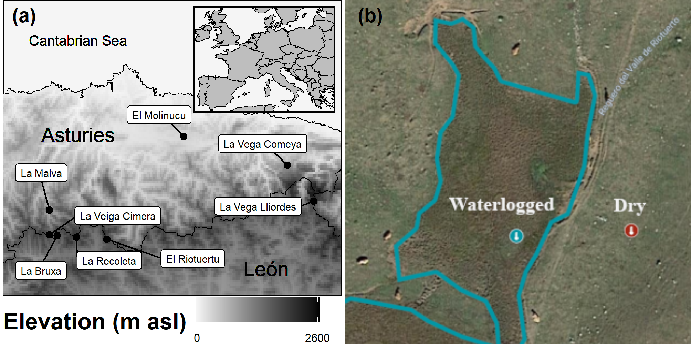
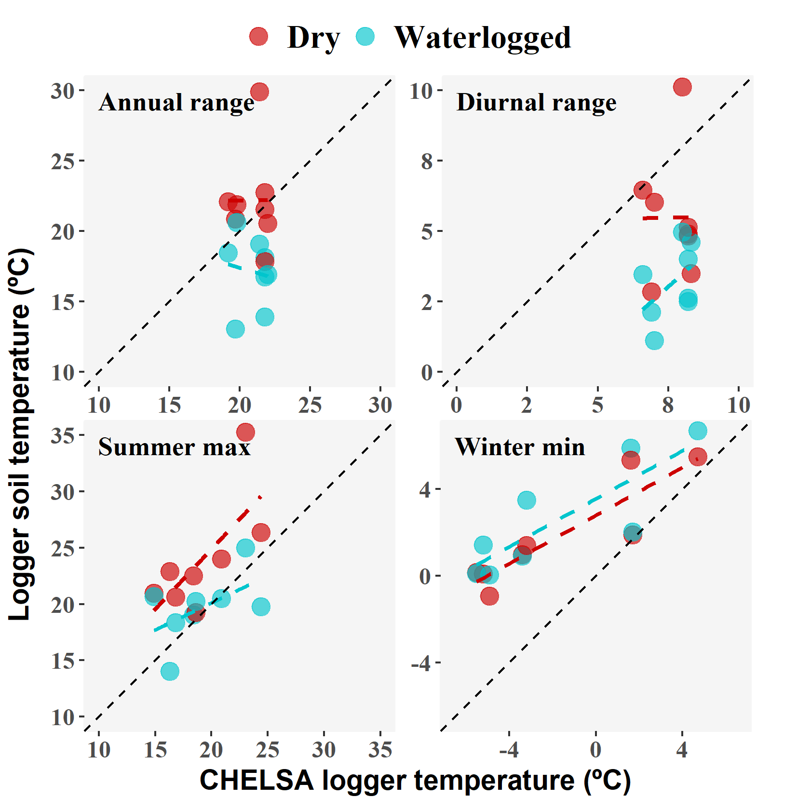

Mire microclimate: groundwater buffers temperature in waterlogged versus
dry soils
================

Eduardo Fernández-Pascual1 +, Eva
Correia-Álvarez1

1 Universidad de Oviedo

+ Correspondence: Departamento de Biología de Organismos y
Sistemas, Universidad de Oviedo, C/ Catedrático Rodrigo Uría, 33006
Oviedo/Uviéu, Spain. Email: <efernandezpascual@gmail.com>. Telephone:
+34985104787.

# Abstract

Ecosystems adapt differently to global warming through microclimatic
factors. Mires are sensitive wetland habitats that strongly rely on
local soil properties, which makes them a good model to understand how
local climatic parameters counteract the effects of climate change. We
quantified the temperature buffering effect in waterlogged mire soils as
compared with adjacent dry soils.

We buried dataloggers at 5 cm depth in waterlogged and dry points in 8
mires of the Cantabrian Mountains (Spain, Southwestern Europe) and
recorded soil temperatures for c. 5 years. We also compared our local
measures with air temperatures predicted by the CHELSA model.

Waterlogged soils had less diurnal thermal amplitude (-2.3 ºC), less
annual thermal amplitude (-5.1 ºC), cooler summer maximums (-4.3 ºC) and
warmer winter minimums (+0.8 ºC). CHELSA air temperatures only
correlated significantly (p \< 0.05) with winter minimum soil
temperatures (Pearson’s r \> 0.83), and CHELSA predictions were less
accurate (higher RMSE) for waterlogged soils, except for the summer
maximums.

We conclude that mire soils show a thermal buffer effect that insulates
them from the surrounding landscape. This effect is stronger at the warm
end of the climatic spectrum, i.e. during summer and at lower
elevations. These results highlight the potential refugial character of
mires under global warming, and the need to integrate microclimate
measurements into climate change models.

**Keywords:** bog, CHELSA, climatic model, datalogger, fen, peatland,
soil temperature, wetland

# Introduction

Climate change (IPCC [2014](#ref-RN3586)) affects global biodiversity,
from drylands (Huang et al. [2016](#ref-RN4672)) to forests (Seidl et
al. [2017](#ref-RN4673)) and oceans (Hoegh-Guldberg et al.
[2017](#ref-RN4674)). An accurate prediction of species responses
requires to focus on physiologically relevant climatic variables related
to critical plant growth periods (Gardner, Maclean, and Gaston
[2019](#ref-RN4765)). Traditional models of species responses to global
warming are based on macroclimatic data from weather stations. Recently,
several authors have pointed out the need of complementing these models
with *in situ* microclimatic measures (Lembrechts, Nijs, and Lenoir
[2019](#ref-RN4758); Lembrechts et al. [2019](#ref-RN4759); Maclean,
Mosedale, and Bennie [2019](#ref-RN4760); Philippov and Yurchenko
[2019](#ref-RN4761)). As has been shown for European forests (Zellweger
et al. [2020](#ref-RN4763)), ecosystems usually respond to broad
climatic changes through local processes. Increasingly there are
downscaling efforts based on atmospheric microclimate networks
distributed in complex terrain that focus on topographic effects on air
temperature (Scherrer and Körner [2010](#ref-RN3279)), but hydrologic
factors under edaphic control require more attention (Ashcroft and
Gollan [2013](#ref-RN4942)).

Mires are permanent semi-terrestrial peatlands whose soils remain
waterlogged but not inundated during most of the year (Wheeler and
Proctor [2000](#ref-RN3161)). The term mire encompasses peatlands that
are classified as either ombrotrophic (rain-fed bogs) or minerotrophic
(groundwater-fed fens). These are azonal habitats whose existence
depends on local soil properties rather than macroclimatic zonation
(Breckle [2002](#ref-RN3328)). Mires meet certain criteria that make
them especially vulnerable to climate change (Horsák et al.
[2018](#ref-RN4675)): (a) preponderance of species that evolved under a
cold climate; (b) low productivity due to nutrient limitation, making
them sensitive to increased nutrient cycling caused by warming
(Cornelissen et al. [2007](#ref-RN4676)); and (c) scattered distribution
pattern, which limits species dispersal and migration (Pearson and
Dawson [2005](#ref-RN4677)). Therefore, mires are priority habitats for
biodiversity conservation, harbouring high numbers of endangered species
(Bergamini et al. [2009](#ref-RN3122)), and supporting highly adapted
floras in spatially reduced areas (Grootjans et al.
[2006](#ref-RN2960)). Worryingly, mires retain high levels of methane
and carbon which can be released due to global warming (Koffi et al.
[2020](#ref-RN4764)). Habitat distribution models have predicted a loss
of mire area as a consequence of ongoing climate change (Essl et al.
[2012](#ref-RN2937)).

It has been known for a relatively long time that groundwater can
produce a buffer effect on soil temperature, keeping soils warmer than
air during cold periods, and vice versa (Frederick [1974](#ref-RN4940);
Ellenberg [1988](#ref-RN3344); Geiger, Aron, and Todhunter
[2009](#ref-RN3201)). Clara M. Frederick ([1974](#ref-RN4940)) showed
the existence of a buffer effect comparing soil temperatures taken at
Cedar Bog (Ohio, United States) with temperatures from a neighbouring
agricultural station. Recently, more soil temperature measurements have
become available for mires of North America (Raney, Fridley, and Leopold
[2014](#ref-RN3204)), Western Europe (Fernández-Pascual et al.
[2015](#ref-RN2356)) and Central Europe (Horsák et al.
[2018](#ref-RN4675)). Their comparison with air temperatures derived
from models has shown that mire soils are indeed warmer in winter and
cooler in summer, thus giving support to the existence of the
groundwater thermal buffer (Fernández-Pascual et al.
[2015](#ref-RN2356); Horsák et al. [2018](#ref-RN4675)). Furthermore,
the effect has been linked to the composition of mire flora and fauna
(Horsák et al. [2018](#ref-RN4675); Schenková et al.
[2020](#ref-RN4679)), the growth rings of mire trees (Raney et al.
[2016](#ref-RN3060)) and the role of mires as glacial refugia
(Jiménez-Alfaro et al. [2016](#ref-RN2513); Dítě et al.
[2017](#ref-RN4680)).

Since root-zone temperature is a major determinant of plant
ecophysiology (Körner and Paulsen [2004](#ref-RN3024)), the groundwater
buffer effect is expected to allow mire plants to live in a wider range
of air temperatures than they could otherwise. Indeed, mires have a
relatively homogeneous flora across their range, despite their broad
distribution. In Europe, fens are distributed from the Iberian Peninsula
to boreal Fennoscandia and from low valleys to the alpine belt (Peterka
et al. [2017](#ref-RN4678)). In the arctic, temperate-continental and
suboceanic regions of boreal Russia mires make up an important part of
the landscape, from 20 to 80 % of the surface of different regions
stretching from Europe to the Pacific (Yurkovskaya [2012](#ref-RN4937)).
In the United States, fens are distributed across the glaciated Midwest
and Northeast, as well as portions of the Appalachian Mountains and
mountainous West (Bedford and Godwin [2003](#ref-RN4933)). However,
continued aridification is expected to significantly reduce the overall
extent of wetlands as it has been shown in the Midwestern United States
(Johnson and Leopold [1994](#ref-RN4934)).

It is evident that the groundwater buffer effect will play a determinant
role in the response of mire habitats to climate change (Raney
[2014](#ref-RN4936)). Both bogs and fens are actively peat forming and
depend on precipitation, but fens rely also on sources of telluric water
from mineral ground. Moreover, they show a mosaic of microreliefs and a
specific plant cover zonation which makes them especially sensitive to
small changes in wetness. Climate change affects the quantity, timing
and spatial distribution of precipitation, leading to changes in surface
wetness which alter the intensity of organic decomposition by disturbing
the conditions for plant grow and the depth of air penetration (Bragg
[2002](#ref-RN4935)). Global warming would also result in warmer
groundwater delivered to fens, but there is a gap of knowledge about the
rate of such changes and their ecological consequences within the mires
(Raney [2014](#ref-RN4936)).

As is the case for all azonal habitats, locally measured temperatures
are essential to understand these processes. Available references
recorded temperatures only on waterlogged soils, using model-derived air
temperatures for comparison (Fernández-Pascual et al.
[2015](#ref-RN2356); Horsák et al. [2018](#ref-RN4675); Schenková et al.
[2020](#ref-RN4679)); or recorded temperatures in both wet and dry spots
but for less than a year, lacking representation throughout the growth
cycle of mire vegetation (Raney, Fridley, and Leopold
[2014](#ref-RN3204); Raney et al. [2016](#ref-RN3060)). This article
provides the first measurement of the thermal buffer against surrounding
non-mire areas, based on soil temperatures recorded during a period of
five years. These measures can be used to support previous evidence
about the general effects of soil moisture on thermal buffering (Raney,
Fridley, and Leopold [2014](#ref-RN3204); Fernández-Pascual et al.
[2015](#ref-RN2356); Horsák et al. [2018](#ref-RN4675); Raney
[2014](#ref-RN4936)) and to determine the magnitude of this buffering
within microrefugia habitats. Specifically, we tested the hypotheses
that, when compared to adjacent dry soils, waterlogged mire soils are
(i) warmer in winter and (ii) colder in summer; and have less thermal
amplitude in (iii) daily and (iv) annual scales. In addition, we
compared *in situ* measurements with data derived from the CHELSA
climatic models (Karger et al. [2017](#ref-RN4766)).

# Materials and methods

This study took place in the temperate oceanic region of north-western
Spain (43º N, 5º W) (**Fig. 1a**). Local geography and climate are
dominated by the Cantabrian Mountains (\> 1500 m above sea level), which
run parallel to the coast and trap the prevailing NW Atlantic winds. In
the study area, average annual precipitation ranges from 800 mm at the
low elevations to 1800 mm at the high mountains, while average annual
temperature ranges from 12.5 ºC to 5 ºC (source = Agencia Estatal de
Meteorología, <http://www.aemet.es/es/serviciosclimaticos/>). Under the
most extreme emissions scenario, the latest projections expect
temperatures to increase by 4 ºC and precipitation to decrease by c. 10
% by the end of the century, although the precipitation projections are
subjected to great uncertainty (Amblar-Francés et al.
[2017](#ref-RN4939)). The present humid and mild climate of this region
harbours the south-western limit of mire communities in Europe
(Jiménez-Alfaro, Díaz González, and Fernández-Pascual
[2011](#ref-RN2982); Fernández Prieto, Fernández Ordóñez, and Collado
Prieto [1985](#ref-RN3246)). Rain-fed raised bogs
(<https://eunis.eea.europa.eu/habitats/260>) are very rare and appear
locally on raised hummocks of acid valley mires
(<https://eunis.eea.europa.eu/habitats/526>) which can be found from the
coast to just below the treeline, in poorly drained valleys and former
glacial lakes. Glacial lakes undergoing silting develop transition mires
and quaking bogs communities
(<https://eunis.eea.europa.eu/habitats/1637>) in the water-to-land
transition. Spring fens appear in the mountains above 1000 m; they range
from soft-water poor fens (<https://eunis.eea.europa.eu/habitats/279>)
on acid bedrocks, to alkaline calcareous fens
(<https://eunis.eea.europa.eu/habitats/277>) on limestone.

**Figure 1** **(a)** *Location of the study sites in northern Spain.*
**(b)** *Representation of the sampling design at El Riotuertu site. The
position of the dry and waterlogged temperature loggers is indicated,
the blue area represents the extent of the waterlogged mire habitat.*

We selected 8 mire sites representing the regional elevation gradient of
mire vegetation and the different mire types (**Table 1**). Although we
classify two of these sites as rain-fed bogs based on their vegetation
(*Oxycocco-Sphagnetea* Br.-Bl. et Tx. ex Westhoff et al. 1946), we must
note that these bogs are very poorly developed on hummocks over valley
mires and are in tight connection to the underlying water table coming
from streams. Therefore, soil waterlogging in all our sites is fed by
streams or springs. In each site, we buried two dataloggers (M-Log5W,
GeoPrecision, Ettlingen, Germany; accuracy: +/- 0.1 ºC (at 0 ºC),
resolution: 0.01 ºC) at a depth of 5 cm below the upper layer of the
soil. In this ecosystem, it is at this depth that true soil begins to
develop, under the porous upper layers made up of live mosses. We
installed one datalogger in a flat waterlogged spot within the mire; the
other one in the close vicinity, but in a flat and dry upland area
outside the mire (**Fig. 1b**). The vegetation at the sampling points
was always either mire or pasture, with no shrubs, trees or any other
landscape features shading the measuring points. Dataloggers recorded
temperature once every hour and stayed on site for approximately five
years, after which we retrieved them and downloaded their records. At
the moment of retrieval, the internal clock of all dataloggers had not
deviated for more than four hours

| Site             | Habitat      |  pH | Conductivity (µS/cm) | Elevation (m) | Latitude | Longitude | Records (days) |
| :--------------- | :----------- | --: | -------------------: | ------------: | -------: | --------: | -------------: |
| El Molinucu      | Raised bog   | 4.2 |                 47.2 |           284 |  43.3924 |  \-5.5392 |           1421 |
| La Malva         | Alkaline fen | 8.2 |                427.7 |           700 |  43.1176 |  \-6.2543 |           1347 |
| La Vega Comeya   | Raised bog   | 5.9 |                102.4 |           822 |  43.2856 |  \-4.9885 |            664 |
| La Bruxa         | Alkaline fen | 8.0 |                271.8 |          1528 |  43.0232 |  \-6.2113 |           1850 |
| La Veiga Cimera  | Acid fen     | 4.6 |                 13.9 |          1552 |  43.0252 |  \-6.2539 |           1850 |
| La Recoleta      | Quaking bog  | 7.2 |                245.9 |          1768 |  43.0167 |  \-6.1112 |           1854 |
| El Riotuertu     | Alkaline fen | 7.3 |                400.1 |          1820 |  43.0096 |  \-5.9479 |           1852 |
| La Vega Lliordes | Alkaline fen | 7.3 |                293.3 |          1878 |  43.1504 |  \-4.8464 |           1809 |

**Table 1** *Mire sites included in this study, indicating the type of
fen, pH, conductivity, elevation, coordinates, and length of the
temperature recording period. Groundwater pH and conductivity values are
the average of 5–10 measures per site taken with a MM40 Portable
Multimeter (Crison Instruments S.A., Alella, Spain). Coordinates are in
decimal degrees WGS84.*

All data processing and analysis was performed in R (R Core Team
[2019](#ref-RN2315)). To clean the logs we took the following steps: (i)
removing records from the first week after installation, to account for
the installation process and the settling of the soils; and (ii) keeping
only time series with records for both the dry and waterlogged points,
because some of the dataloggers had failed at different points in time.
Afterwards, we calculated four bioclimatic variables for each
datalogger: (1) the mean diurnal range; i.e. the average for the whole
period of the daily differences between the maximum and the minimum
temperatures recorded in the day; (2) the maximum temperature of the
warmest month; i.e. the average of the daily maximum records, for the
warmest month; (3) the minimum temperature of the coldest month;
i.e. the average of the daily minimum records, for the coldest month;
and (4) the annual range; i.e. the difference between the maximum
temperature of the warmest month and the minimum temperature of the
coldest month. These are classical bioclimatic variables that indicate
the limiting factors (extreme temperatures) and seasonality (diurnal and
annual range) that organisms must tolerate (O’Donnell and Ignizio
[2012](#ref-RN4943)). To compare our measurements with model-based
predictions of air temperature, we downloaded from CHELSA the same
bioclimatic variables for our measuring coordinates
(<https://chelsa-climate.org/bioclim/>).

To test if the differences between dry and waterlogged points were
significant, we used paired t-tests (n = 8 paired sites per each of the
four bioclimatic variables). Tests were one-tailed, according to the
original hypotheses: the dry point would have a higher diurnal range, a
higher maximum temperature, a lower minimum temperature, and a higher
annual range. To compare our soil measurements with the CHELSA air
temperatures we calculated Pearson’s correlation between both sets of
values, and we also calculated the root-mean-square error (RMSE) of the
CHELSA values as a measure of their accuracy (n = 8 sites per
combination of bioclimatic variable and dry/waterlogged condition). We
calculated RMSE using its implementation in the package *Metrics*
(Hamner and Frasco [2018](#ref-RN4941)). We checked whether our data
complied with the normality assumption of the t-test and Pearson’s
correlation using the Shapiro-Wilk normality test; the assumption was
met in all cases (p \> 0.05). To check whether the analyses were
influenced by the fact that recording periods did not match across all
eight sites, we repeated the analyses using only full-year,
contemporaneous data series (01 Jan 2015 - 31 Dec 2017, excluding La
Vega Comeya); the results of these analyses were the same as the ones
presented in this article ([Supplementary **Tables S1** and
**S2**](https://github.com/efernandezpascual/mires/blob/master/doc/supplementary.md)).

# Results

Dataloggers recorded temperatures for five years in five of the sites,
four years in two, and two years in one. Time series showed considerably
less variation at waterlogged points, for all eight site comparisons
(**Fig. 2**).

**Figure 2** *Hourly soil temperature records at the mire sites. The
blue series was recorded within the mire, in a waterlogged area. The red
series was recorded in a neighbouring dry area. Dataloggers were buried
at 5 cm depth. The amplitude of diurnal temperature range in dry sites
was reduced with increasing elevation, where the thermal buffer effect
was also less apparent.*

Bioclimatic variables (**Table 2** and **Fig. 3**) supported this
notion. The mean annual range was wider at dry points, as was the mean
diurnal range. Maximum temperatures of the warmest months were usually
higher at dry measuring points. The opposite was true for the minimums
of the coldest months, in which case temperature was generally colder at
dry points, although the difference was less pronounced than for the
maximums (**Fig. 3**).

**Figure 3** *Average bioclimatic variables in the dry and waterlogged
points. The bars represent the mean value, and the brackets the standard
error of 8 records.*

Patterns regarding the maximum temperatures and annual range were
especially noticeable at both low (El Molinucu, La Malva) and high (La
Recoleta) elevations. The pattern for the diurnal range, however, was
more prominent just at the low sites (El Molinucu, La Malva), whereas
the minimums of the coldest months showed no specific pattern (**Table
2**).

T-tests supported the original hypotheses; namely waterlogged measuring
points had (a) smaller diurnal fluctuations (t = -3.05, p = 0.009,
effect size = -2.29 ºC, 95 % CI = -∞, -0.87); (b) lower maximums (t =
-3.04, p = 0.009, effect size = -4.28 ºC, 95 % CI = -∞, -1.61); (c)
higher minimums (t = 2.86, p = 0.012, effect size = 0.77 ºC, 95 % CI =
0.26, ∞), and (d) smaller annual fluctuations (t = -3.95, p = 0.003,
effect size = -5.05 ºC, 95 % CI = -∞, -2.63).

| Site             | Annual range | Diurnal range | Summer max | Winter min |
| :--------------- | -----------: | ------------: | ---------: | ---------: |
| El Molinucu      |       \-7.80 |        \-4.90 |     \-6.59 |       1.21 |
| La Malva         |      \-10.81 |        \-5.14 |    \-10.25 |       0.56 |
| La Vega Comeya   |       \-3.63 |        \-2.99 |     \-3.51 |       0.12 |
| La Bruxa         |       \-1.09 |        \-0.88 |       0.99 |       2.08 |
| La Veiga Cimera  |       \-3.41 |        \-2.21 |     \-3.47 |     \-0.06 |
| La Recoleta      |       \-8.81 |        \-2.62 |     \-8.85 |     \-0.04 |
| El Riotuertu     |       \-3.62 |          1.12 |     \-2.28 |       1.34 |
| La Vega Lliordes |       \-1.26 |        \-0.71 |     \-0.28 |       0.98 |

**Table 2** *Groundwater buffer effect per mire and bioclimatic
variable. The buffer effect was calculated as the difference between the
value in the waterlogged and the dry points.*

The CHELSA climatic model (**Table 3** and **Fig. 4**) provided air
temperatures that significantly correlated (p \< 0.05) with soil
temperatures only in the case of the minimums of the coldest month, both
at dry points (Pearson’s r = 0.90) and waterlogged points (Pearson’s r =
0.84). The correlation between CHELSA and soil values was marginally
significant (p = 0.05) in the case of the maximums of the warmest month,
but only at dry points (Pearson’s r = 0.71). The values of CHELSA did
not correlate with soil temperatures in the rest of the cases (p \>
0.05). RMSE indicated that the predictions of CHELSA were more accurate
at dry points for the cases of the annual range, the diurnal range and
the winter min; the CHELSA values were more accurate at waterlogged
points in the case of the summer max.

| Variable      | Groundwater |       t | df |     p | Pearson’s r | RMSE (ºC) |
| :------------ | :---------- | ------: | -: | ----: | ----------: | --------: |
| Annual range  | Dry         |   0.012 |  6 | 0.991 |        0.00 |      3.62 |
| Annual range  | Waterlogged | \-0.334 |  6 | 0.750 |      \-0.14 |      4.71 |
| Diurnal range | Dry         |   0.016 |  6 | 0.988 |        0.01 |      3.09 |
| Diurnal range | Waterlogged |   1.354 |  6 | 0.225 |        0.48 |      4.62 |
| Summer max    | Dry         |   2.450 |  6 | 0.050 |        0.71 |      5.86 |
| Summer max    | Waterlogged |   1.527 |  6 | 0.178 |        0.53 |      2.95 |
| Winter min    | Dry         |   5.115 |  6 | 0.002 |        0.90 |      4.04 |
| Winter min    | Waterlogged |   3.809 |  6 | 0.009 |        0.84 |      4.82 |

**Table 3** *Comparison of soil bioclimatic variables with CHELSA air
temperatures, per bioclimatic variable and groundwater situation. RMSE
is the root-mean-square error, a measure of the accuracy of the
predictions (lower values indicate higher accuracy).*

**Figure 4** *Scatter plots of the bioclimatic variables predicted by
CHELSA air temperatures vs. soil temperatures measured in situ, in dry
and waterlogged points.*

# Discussion

The results presented here quantify the size of the thermal buffer
effect that takes place in waterlogged mire soils (Frederick
[1974](#ref-RN4940)), when compared with adjacent dry soils. The mire
thermal buffer had been compared previously with air temperatures
derived from models, with generally similar results (Fernández-Pascual
et al. [2015](#ref-RN2356); Horsák et al. [2018](#ref-RN4675)). The mire
buffer had also been compared to dry soils at 10 cm depth (Raney,
Fridley, and Leopold [2014](#ref-RN3204); Raney et al.
[2016](#ref-RN3060)); our results confirm those findings at 5 cm depth
and extend them to the full year. Also, in concordance with our results,
the air temperature measured at 0.5 m from the surface of boreal Russian
bogs is lower at the wetter zones, at least during the warmest months
(Philippov and Yurchenko [2019](#ref-RN4761)). Thus, the pattern is
reproducible among years (out to five years), seems to take place both
at southern and northern latitudes, and may affect not only the
temperature in the soil but also air temperatures within a certain
distance from the soil. The thermal buffer effect of mire soils that
makes their temperatures less extreme than the surrounding landscape is
therefore a general phenomenon. The existence of this buffer effect
highlights the importance of using fine-scale microclimatic data to
assess vegetation responses to climate change (Storlie et al.
[2014](#ref-RN4683); Lembrechts, Nijs, and Lenoir [2019](#ref-RN4758);
Zellweger et al. [2020](#ref-RN4763)).

One important difference with previous studies is the magnitude of the
buffer during winter. The articles that had used model air temperatures
as a control concluded that the buffer effect was stronger at the cold
end of the thermal spectrum, i.e. in winter and at night
(Fernández-Pascual et al. [2015](#ref-RN2356); Horsák et al.
[2018](#ref-RN4675)). In the case of this investigation, the situation
is the reverse: the effect is weaker when considering the minimum
temperatures of the cold period. This indicates the importance of
identifying root temperatures when working with plant communities. At
high elevations of the study region, the soil can remain covered by snow
for periods of winter, and this has its own insulating effect on soil
temperatures (Körner [2003](#ref-RN2392)). Indeed, snow cover has been
described as one of the vertical features that affects vegetation
distribution in a local manner (Maclean, Mosedale, and Bennie
[2019](#ref-RN4760)). In any case, since this study was conducted at the
southern limit of mire distribution, more research on the winter buffer
is needed at high latitudes, since it might have a deeper biological
significance there.

In these southern mires, the buffering effect is much stronger during
the summer (**Fig. 5**). This is most noticeable in the two lowest
elevations, El Molinucu and La Malva. La Malva shows especially high
summer temperatures within the dry soils (\> 40 ºC). It must be noted
that this difference of \> 15 ºC between the dry and waterlogged points
of La Malva, which are separated by a few meters, is almost four times
the warming expected in the study region at the end of this century (+ 4
ºC) under the most extreme emissions scenario (Amblar-Francés et al.
[2017](#ref-RN4939)). Whereas the rest of the study sites are flat, La
Malva is a calcareous spring in a southeast-facing slope on limestone, a
place experiencing sub-Mediterranean conditions at the micro-scale
(Sánchez de Dios, Benito-Garzón, and Sainz-Ollero [2009](#ref-RN4681)),
and surrounded by a forest of evergreen oaks (*Quercus rotundifolia*
Lam., *Quercus faginea* Lam.). This suggests the importance of
groundwater in the existence of mire vegetation in Mediterranean areas
(Aldasoro et al. [1996](#ref-RN4682)), not only from the
water-availability aspect, but also providing cooling regulation during
summer (Ellenberg [1988](#ref-RN3344)). The buffering is also prominent
at one of the highest elevations, La Recoleta, which may be explained by
the high saturation of water in this kind of habitat, a quaking bog,
i.e. a former glacial lake undergoing silting. However, the relatively
small number of sites in our study does not allow to explore further the
moderating factors that may drive differences in the strength of the
buffer. More studies focusing on each kind of habitat are needed to
understand the relation between hydrology conditions and microclimatic
effects.

**Figure 5** *Complementary temporal analysis of the groundwater buffer
effect during peak hot events. Variation of soil temperatures at paired
sites (dry vs. waterlogged points) during exceptionally warm days of the
warm season. Exceptionally warm days were considered those with a daily
maximum (at the dry point) belonging to the 90th percentile of daily
maximums for the site. The 1:1 line (corresponding to no buffer effect)
is shown, points falling to the right of this line show a buffer effect
(i.e. soil temperatures at the waterlogged point are cooler than the
neighbouring dry site).*

Most models currently employed to predict vegetation and species
distribution use macroclimatic parameters, like the ones obtained from
CHELSA (Karger et al. [2017](#ref-RN4766)). This study revealed that
CHELSA values correlate relatively well with soil temperatures in the
case of the minimum temperatures of the coldest month, but not with the
rest of the bioclimatic variables under examination. Moreover, CHELSA
predictions are less accurate for waterlogged soils, except for the
summer max, which might be the consequence of the noise introduced by
sun-heated soil. In addition to the water buffering effect, other
features may explain the differences between our results and CHELSEA
values, like the height of temperature measurement (5 cm below the upper
layer of the soil in our study versus 2 m above the ground in CHELSA);
the temporal scale of observation (hourly based for a 5-year period in
our study versus a 34-year period); and the spatial resolution (c. 1 m
in our study versus c. 1 km). Be that as it may, our results bring out
the importance of considering local factors as drivers of microclimatic
changes (Zellweger et al. [2019](#ref-RN4762)). These factors contribute
to landscape heterogeneity, producing safe sites that can act as
micro-refuges and buffer species from regional climatic warming.

In summary, this article shows that waterlogged mire soils have a
thermal buffer when compared to adjacent soils, contributing to their
behaviour as mild island habitats in a landscape that can be more
thermally variable (Raney [2014](#ref-RN4936); Horsák et al.
[2018](#ref-RN4675)). The effect occurs during cold and warm periods,
but it is stronger during the summer, at least in the study area.
However, this climatic buffering within microrefugia relies strongly on
the water regime, a key factor for its conservation. Long-term decreases
in precipitation could reduce the groundwater discharge into the mires,
with potentially fatal consequences if the mires dry out during warmer
summers. Rain-fed bogs will be affected more immediately than spring
fens since the latter are somewhat decoupled from short-term rainfall
variation. However, long-term regional drying would affect all types of
mires. For the study area, the latest projections envision a decrease of
c. 10 % in annual precipitation at the end of the century, but these
projections are still subjected to a high level of uncertainty
(Amblar-Francés et al. [2017](#ref-RN4939)). Future recording schemes
are needed to monitor the evolution of the soil thermal buffer in drying
regions, to obtain local soil temperatures from other latitudes, and
from more microtopographies within the same mire. We must also consider
that the microclimatic effect is not limited to mires as it can also be
found in other habitats where a gradient of moisture exists (Ashcroft
and Gollan [2013](#ref-RN4942)), such as the mosaic of microtopographies
(snow patches, fellfields) that is characteristic of alpine environments
(Scherrer and Körner [2010](#ref-RN3279); Ohler, Lechleitner, and Junker
[2020](#ref-RN4938)). This study provides useful microclimate parameters
to improve the current models that predict the impact of global warming
on moisture-driven ecosystems.

# Acknowledgements

Eduardo Fernández-Pascual received financial support from the Government
of Asturias and the FP7 – Marie Curie – COFUND programme of the European
Commission (Grants “Clarín” ACA14-19 and ACB17-19). Logger installation
was partly supported by the LIFE+ programme of the European Commission
(project LIFE11/NAT/ES/707 - TREMEDAL).

# Data availability

The original data, as well as the R code for the analysis and creation
of the manuscript, can be accessed at the GitHub repository
<https://github.com/efernandezpascual/mires>. A version of record of the
repository can be found at <https://doi.org/10.5281/zenodo.4081418>.

# Supporting information

[**Tables
S1-S2**](https://github.com/efernandezpascual/mires/blob/master/doc/supplementary.md)
Results of the statistical analyses, repeated using only the
contemporaneous full-year data series.

# References

Aldasoro, Juan José, C. Aedo, J. Muñoz, D De Hoyos, JC Vega, A Negro,
and Gonzalo Moreno. 1996. “A survey on Cantabrian mires (Spain).”
*Anales Del Jardín Botánico de Madrid* 54 (1): 472–89.

Amblar-Francés, P, MJ Casado-Calle, MA Pastor-Saavedra, P Ramos-Calzado,
and E Rodríguez-Camino. 2017. *Guía de escenarios regionalizados de
cambio climático sobre España a partir de los resultados del IPCC-AR5*.
Madrid: Ministerio de Agricultura y Pesca, Alimentación y Medio
Ambiente. Agencia Estatal de Meteorología.

Ashcroft, Michael B., and John R. Gollan. 2013. “Moisture, thermal
inertia, and the spatial distributions of near-surface soil and air
temperatures: understanding factors that promote microrefugia.”
*Agricultural and Forest Meteorology* 176: 77–89.
<https://doi.org/https://doi.org/10.1016/j.agrformet.2013.03.008>.

Bedford, Barbara L., and Kevin S. Godwin. 2003. “Fens of the United
States: distribution, characteristics, and scientific connection versus
legal isolation.” *Wetlands* 23 (3): 608–29.
[https://doi.org/10.1672/0277-5212(2003)023\[0608:FOTUSD\]2.0.CO;2](https://doi.org/10.1672/0277-5212\(2003\)023%5B0608:FOTUSD%5D2.0.CO;2).

Bergamini, A., M. Peintinger, S. Fakheran, H. Moradi, B. Schmid, and J.
Joshi. 2009. “Loss of habitat specialists despite conservation
management in fen remnants 1995-2006.” *Perspectives in Plant Ecology,
Evolution and Systematics* 11 (1): 65–79.
<https://doi.org/10.1016/j.ppees.2008.10.001>.

Bragg, O. M. 2002. “Hydrology of peat-forming wetlands in Scotland.”
*Science of the Total Environment* 294 (1-3): 111–29.
<https://doi.org/10.1016/s0048-9697(02)00059-1>.

Breckle, Siegmar-Walter. 2002. *Walter’s Vegetation of the Earth: the
Ecological Systems of the Geo-biosphere*. Berlin - Heidelberg - New
York: Springer.

Cornelissen, Johannes H. C., Peter M. Van Bodegom, Rien Aerts, Terry V.
Callaghan, Richard S. P. Van Logtestijn, Juha Alatalo, F. Stuart Chapin,
et al. 2007. “Global negative vegetation feedback to climate warming
responses of leaf litter decomposition rates in cold biomes.” *Ecology
Letters* 10 (7): 619–27.
<https://doi.org/10.1111/j.1461-0248.2007.01051.x>.

Dítě, Daniel, Tomáš Peterka, Zuzana Dítětová, Petra Hájková, and Michal
Hájek. 2017. “Arcto-Alpine species at their niche margin: the Western
Carpathian refugia of *Juncus castaneus* and *J. triglumis* in
Slovakia.” *Annales Botanici Fennici* 54 (1–3): 67–82, 16.
<https://doi.org/10.5735/085.054.0311>.

Ellenberg, Heinz. 1988. “Spring areas and adjacent swamps.” In
*Vegetation Ecology of Central Europe*, 313–13. Cambridge: Cambridge
University Press.

Essl, Franz, Stefan Dullinger, Dietmar Moser, Wolfgang Rabitsch, and
Ingrid Kleinbauer. 2012. “Vulnerability of mires under climate change:
implications for nature conservation and climate change adaptation.”
*Biodiversity and Conservation* 21: 655–69.

Fernández-Pascual, Eduardo, Borja Jiménez-Alfaro, Michal Hájek, Tomás E.
Díaz, and Hugh W. Pritchard. 2015. “Soil thermal buffer and regeneration
niche may favour calcareous fen resilience to climate change.” *Folia
Geobotanica* 50 (4): 293–301.
<https://doi.org/10.1007/s12224-015-9223-y>.

Fernández Prieto, José Antonio, María del Carmen Fernández Ordóñez, and
Miguel Ángel Collado Prieto. 1985. “Datos sobre la vegetación de las
turberas de esfagnos galaico-asturianas y orocantábricas.” *Lazaroa* 7:
443–71.

Frederick, Clara May. 1974. “A natural history study of the vascular
flora of Cedar Bog, Champaign County, Ohio.” *The Ohio Journal of
Science* 74 (2): 65–116.

Gardner, Alexandra S., Ilya M. D. Maclean, and Kevin J. Gaston. 2019.
“Climatic predictors of species distributions neglect
biophysiologically meaningful variables.” *Diversity and Distributions*
25 (8): 1318–33. <https://doi.org/10.1111/ddi.12939>.

Geiger, Rudolf, Robert H. Aron, and Paul Todhunter. 2009. *The Climate
Near the Ground*. Lanham: Rowman & Littlefield.

Grootjans, A. P., E. B. Adema, W. Bleuten, H. Joosten, M. Madaras, and
M. Janáková. 2006. “Hydrological landscape settings of base-rich fen
mires and fen meadows: an overview.” *Applied Vegetation Science* 9:
175–84.
<http://search.ebscohost.com/login.aspx?direct=true&db=aph&AN=25691039&lang=es&site=ehost-live>.

Hamner, B, and M Frasco. 2018. “Metrics: Evaluation Metrics for Machine
Learning. R package version 0.1.4.
https://CRAN.R-project.org/package=Metrics.”

Hoegh-Guldberg, Ove, Elvira S. Poloczanska, William Skirving, and Sophie
Dove. 2017. “Coral reef ecosystems under climate change and ocean
acidification.” *Frontiers in Marine Science* 4 (158).
<https://doi.org/10.3389/fmars.2017.00158>.

Horsák, Michal, Vendula Polášková, Marie Zhai, Jindřiška Bojková, Vít
Syrovátka, Vanda Šorfová, Jana Schenková, Marek Polášek, Tomáš Peterka,
and Michal Hájek. 2018. “Spring-fen habitat islands in a warming
climate: partitioning the effects of mesoclimate air and water
temperature on aquatic and terrestrial biota.” *Science of the Total
Environment* 634: 355–65.
<https://doi.org/https://doi.org/10.1016/j.scitotenv.2018.03.319>.

Huang, Jianping, Haipeng Yu, Xiaodan Guan, Guoyin Wang, and Ruixia Guo.
2016. “Accelerated dryland expansion under climate change.” *Nature
Climate Change* 6 (2): 166–71. <https://doi.org/10.1038/nclimate2837>.

IPCC. 2014. *Climate Change 2014: Synthesis Report. Contribution of
Working Groups I, II and III to the Fifth Assessment Report of the
Intergovernmental Panel on Climate Change \[Core Writing Team, R.K.
Pachauri and L.A. Meyer (eds.)\]*. Geneva: IPCC.

Jiménez-Alfaro, Borja, Tomás Díaz González, and Eduardo
Fernández-Pascual. 2011. “Grupos de vegetación y hábitats de tremedales
neutro-basófilos en las montañas pirenaico-cantábricas.” *Acta Botanica
Barcinonensia* 53: 47–60.

Jiménez-Alfaro, Borja, Laura García-Calvo, Pedro García, and José Luis
Acebes. 2016. “Anticipating extinctions of glacial relict populations in
mountain refugia.” *Biological Conservation* 201: 243–51.

Johnson, Anne M., and Donald J. Leopold. 1994. “Vascular plant species
richness and rarity across a minerotrophic gradient in wetlands of St.
Lawrence County, New York, USA.” *Biodiversity and Conservation* 3 (7):
606–27. <https://doi.org/10.1007/BF00114204>.

Karger, Dirk Nikolaus, Olaf Conrad, Jürgen Böhner, Tobias Kawohl, Holger
Kreft, Rodrigo Wilber Soria-Auza, Niklaus E. Zimmermann, H. Peter
Linder, and Michael Kessler. 2017. “Climatologies at high resolution for
the earth’s land surface areas.” *Scientific Data* 4 (1): 170122.
<https://doi.org/10.1038/sdata.2017.122>.

Koffi, Ernest N., Peter Bergamaschi, Romain Alkama, and Alessandro
Cescatti. 2020. “An observation-constrained assessment of the climate
sensitivity and future trajectories of wetland methane emissions.”
*Science Advances* 6 (15): eaay4444.
<https://doi.org/10.1126/sciadv.aay4444>.

Körner, Christian. 2003. *Alpine Plant Life: Functional Plant Ecology of
High Mountain Ecosystems*. 2nd ed. Berlin - Heidelberg - New York:
Springer.

Körner, Christian, and Jens Paulsen. 2004. “A world-wide study of high
altitude treeline temperatures.” *Journal of Biogeography* 31: 713–32.
[http://10.0.4.87/j.1365-2699.2003.01043.x&#10;http://search.ebscohost.com/login.aspx?direct=true\&db=aph\&AN=12823821\&lang=es\&site=ehost-live](http://10.0.4.87/j.1365-2699.2003.01043.x%0Ahttp://search.ebscohost.com/login.aspx?direct=true&db=aph&AN=12823821&lang=es&site=ehost-live).

Lembrechts, Jonas J., Jonathan Lenoir, Nina Roth, Tarek Hattab, Ann
Milbau, Sylvia Haider, Loïc Pellissier, et al. 2019. “Comparing
temperature data sources for use in species distribution models: from
in-situ logging to remote sensing.” *Global Ecology and Biogeography* 28
(11): 1578–96. <https://doi.org/10.1111/geb.12974>.

Lembrechts, Jonas J., Ivan Nijs, and Jonathan Lenoir. 2019.
“Incorporating microclimate into species distribution models.”
*Ecography* 42 (7): 1267–79. <https://doi.org/10.1111/ecog.03947>.

Maclean, Ilya M. D., Jonathan R. Mosedale, and Jonathan J. Bennie. 2019.
“Microclima: an R package for modelling meso- and microclimate.”
*Methods in Ecology and Evolution* 10 (2): 280–90.
<https://doi.org/10.1111/2041-210x.13093>.

O’Donnell, Michael S, and Drew A Ignizio. 2012. “Bioclimatic predictors
for supporting ecological applications in the conterminous United
States.” *US Geological Survey Data Series* 691 (10).

Ohler, Lisa-Maria, Martin Lechleitner, and Robert R. Junker. 2020.
“Microclimatic effects on alpine plant communities and flower-visitor
interactions.” *Scientific Reports* 10 (1): 1366.
<https://doi.org/10.1038/s41598-020-58388-7>.

Pearson, Richard G., and Terence P. Dawson. 2005. “Long-distance plant
dispersal and habitat fragmentation: identifying conservation targets
for spatial landscape planning under climate change.” *Biological
Conservation* 123 (3): 389–401.
<https://doi.org/https://doi.org/10.1016/j.biocon.2004.12.006>.

Peterka, Tomáš, Michal Hájek, Martin Jiroušek, Borja Jiménez-Alfaro,
Liene Aunina, Ariel Bergamini, Daniel Dítě, et al. 2017. “Formalized
classification of European fen vegetation at the alliance level.”
*Applied Vegetation Science* 20 (1): 124–42.
<https://doi.org/10.1111/avsc.12271>.

Philippov, Dmitriy A., and Victoria V. Yurchenko. 2019. “Data on air
temperature, relative humidity and dew point in a boreal *Sphagnum* bog
and an upland site (Shichengskoe mire system, North-Western Russia).”
*Data in Brief* 25: 104156.
<https://doi.org/https://doi.org/10.1016/j.dib.2019.104156>.

Raney, Patrick A. 2014. *Identifying potential refugia from climate
change in wetlands*. Syracuse, New York: Doctoral thesis, State
University of New York.

Raney, Patrick A, Jason D Fridley, and Donald J Leopold. 2014.
“Characterizing microclimate and plant community variation in
wetlands.” *Wetlands* 34 (1): 43–53.
<https://doi.org/10.1007/s13157-013-0481-2>.

Raney, Patrick A, Donald J Leopold, Martin Dovčiak, and Colin M Beier.
2016. “Hydrologic position mediates sensitivity of tree growth to
climate: groundwater subsidies provide a thermal buffer effect in
wetlands.” *Forest Ecology and Management* 379: 70–80.

R Core Team. 2019. “R: a language and environment for statistical
computing.” <https://www.r-project.org/>.

Sánchez de Dios, Rut, Marta Benito-Garzón, and Helios Sainz-Ollero.
2009. “Present and future extension of the Iberian submediterranean
territories as determined from the distribution of marcescent oaks.”
*Plant Ecology* 204 (2): 189–205.
<https://doi.org/10.1007/s11258-009-9584-5>.

Schenková, Jana, Vendula Polášková, Martina Bílková, Jindřiška Bojková,
Vít Syrovátka, Marek Polášek, and Michal Horsák. 2020. “Climatically
induced temperature instability of groundwater-dependent habitats will
suppress cold-adapted Clitellata species.” *International Review of
Hydrobiology* 105: 85–93. <https://doi.org/10.1002/iroh.201902006>.

Scherrer, Daniel, and Christian Körner. 2010. “Infra-red thermometry of
alpine landscapes challenges climatic warming projections.” *Global
Change Biology* 16 (9): 2602–13.
<https://doi.org/10.1111/j.1365-2486.2009.02122.x>.

Seidl, Rupert, Dominik Thom, Markus Kautz, Dario Martin-Benito, Mikko
Peltoniemi, Giorgio Vacchiano, Jan Wild, et al. 2017. “Forest
disturbances under climate change.” *Nature Climate Change* 7 (6):
395–402. <https://doi.org/10.1038/nclimate3303>.

Storlie, Collin, Andres Merino-Viteri, Ben Phillips, Jeremy VanDerWal,
Justin Welbergen, and Stephen Williams. 2014. “Stepping inside the
niche: microclimate data are critical for accurate assessment of
species’ vulnerability to climate change.” *Biology Letters* 10 (9):
20140576. <https://doi.org/doi:10.1098/rsbl.2014.0576>.

Wheeler, B. D., and M. C. F. Proctor. 2000. “Ecological gradients,
subdivisions and terminology of north-west European mires.” *Journal of
Ecology* 88 (2): 187–203.
<https://doi.org/10.1046/j.1365-2745.2000.00455.x>.

Yurkovskaya, Tatiana. 2012. “Mires on the map of Russia.” In *Mires from
Pole to Pole*, edited by Tapio Lindholm and Raimo Heikkilä, 31–38.
Helsinki: Finnish Environment Institute.

Zellweger, Florian, Pieter De Frenne, Jonathan Lenoir, Duccio Rocchini,
and David Coomes. 2019. “Advances in microclimate ecology arising from
remote sensing.” *Trends in Ecology & Evolution* 34 (4): 327–41.
<https://doi.org/https://doi.org/10.1016/j.tree.2018.12.012>.

Zellweger, Florian, Pieter De Frenne, Jonathan Lenoir, Pieter
Vangansbeke, Kris Verheyen, Markus Bernhardt-Römermann, Lander Baeten,
et al. 2020. “Forest microclimate dynamics drive plant responses to
warming.” *Science* 368 (6492): 772–75.
<https://doi.org/10.1126/science.aba6880>.

